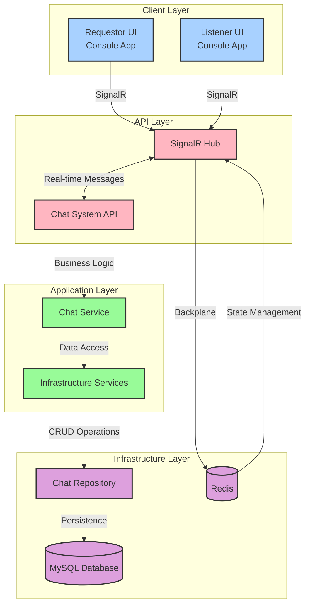

# Chat System

## Project Overview
The Chat System is a real-time chat application designed to facilitate communication between requestors and listeners. It leverages SignalR for real-time messaging and uses a microservices architecture with Docker for containerization.

## Architecture
The system consists of several components:
- **API**: The backend service handling chat logic and database interactions.
- **Requestor UI**: A console application for users initiating chat requests.
- **Listener UI**: A console application for users accepting and participating in chats.
- **MySQL**: A relational database for storing chat data.
- **Redis**: Used as a backplane for SignalR to manage real-time connections.

## Architecture Diagram


### Diagram Explanation
The architecture diagram illustrates the structure of the Chat System, divided into four layers:

- **Client Layer**: Consists of the Requestor UI and Listener UI, which are console applications that interact with users.
- **API Layer**: Contains the Chat System API and SignalR Hub, responsible for handling real-time communication and API requests.
- **Application Layer**: Includes the Chat Service and Infrastructure Services, which manage business logic and data access.
- **Infrastructure Layer**: Comprises the Chat Repository, MySQL Database, and Redis (previously used for SignalR backplane), handling data persistence and state management.

The diagram shows how each layer communicates:
- The Client Layer communicates with the API Layer via SignalR for real-time messaging.
- The API Layer processes messages and business logic, interacting with the Application Layer.
- The Application Layer accesses data through the Infrastructure Layer.
- Redis was used for state management and as a backplane for SignalR, but has been removed from the current setup.

## Setup Instructions
### Prerequisites
- Docker and Docker Compose
- .NET SDK 8.0

### Installation
1. Clone the repository:
   ```bash
   git clone https://github.com/yourusername/chatsystem.git
   cd chatsystem
   ```
2. Build and start the Docker containers:
   ```bash
   docker-compose up --build
   ```

## Usage
### Running the UI Applications
- **Requestor UI**:
  ```bash
  cd src/frontend/ChatSystem.RequestorUI
  dotnet run
  ```
- **Listener UI**:
  ```bash
  cd src/frontend/ChatSystem.ListenerUI
  dotnet run
  ```

### API Endpoints
- `POST /api/chat/requests`: Create a new chat request.
- `GET /api/chat/requests`: Retrieve pending chat requests.
- `GET /api/chat/rooms/{userId}`: Get active chat rooms for a user.

## Testing
Run the tests using the following command:
```bash
cd src/api/ChatSystem.Tests
 dotnet test
```

## Deployment
To deploy the application, ensure all services are containerized and use a cloud provider that supports Docker, such as AWS, Azure, or Google Cloud.

## Contributing
1. Fork the repository.
2. Create a new branch for your feature or bugfix.
3. Commit your changes and push to your fork.
4. Submit a pull request with a detailed description of your changes.

## License
This project is licensed under the MIT License. See the LICENSE file for details. 